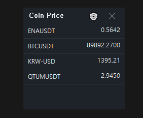
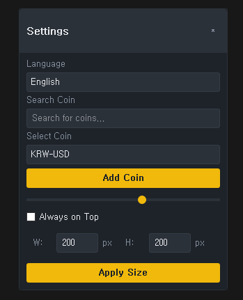

# Real-time Cryptocurrency Price Monitoring Widget




## Introduction
This program is a lightweight widget for monitoring cryptocurrency prices in real-time on your desktop. It utilizes Binance exchange's real-time price information and provides a user-friendly interface.

## Key Features

### Basic Features
- Real-time cryptocurrency price monitoring
- KRW-USD exchange rate information
- Binance exchange API integration
- Coin search and add/remove functionality

### User Interface
- Adjustable transparency (0-100%)
- Always on top option
- Flexible window size adjustment
- Screen edge magnetic effect
- Free position movement via drag

### Convenience Features
- Auto-connect to exchange page with double-click
- Quick coin removal with right-click
- Multi-language support (Korean/English)
- Automatic settings save


# 실시간 암호화폐 가격 모니터링 위젯

## 소개
이 프로그램은 데스크톱에서 실시간으로 암호화폐 가격을 모니터링할 수 있는 경량 위젯입니다. 바이낸스 거래소의 실시간 가격 정보를 활용하며, 사용자 친화적인 인터페이스를 제공합니다.

## 주요 기능

### 기본 기능
- 실시간 암호화폐 가격 모니터링
- KRW-USD 환율 정보 제공
- 바이낸스 거래소 API 연동
- 코인 검색 및 추가/제거 기능

### 사용자 인터페이스
- 투명도 조절 가능 (0-100%)
- 항상 위에 표시 옵션
- 자유로운 창 크기 조절
- 화면 가장자리 자석 효과
- 드래그로 자유로운 위치 이동

### 편의 기능
- 코인 더블클릭 시 거래소 페이지 자동 연결
- 우클릭으로 코인 빠른 제거
- 다국어 지원 (한국어/영어)
- 설정 자동 저장


## 설치 방법

### 필수 요구사항
- Python 3.7 이상
- Windows 운영체제

### 필요한 패키지 설치
```bash
pip install PyQt5 requests pywin32
```

### 실행 방법
1. 저장소 클론 또는 다운로드
2. 필요한 파일 구성 확인
   - bitcoin_live.py
   - layout_settings.py
   - config.json
   - language.json
3. 프로그램 실행
```bash
python bitcoin_live.py
```


## 상세 사용 방법

### 초기 설정
1. 프로그램 첫 실행 시 설정(⚙) 버튼 클릭
2. 원하는 코인 검색 후 추가
3. 투명도, 창 크기, 언어 등 기본 설정 조정

### 코인 관리
- **코인 추가**: 설정 창에서 코인 검색 후 추가
- **코인 제거**: 코인 목록에서 우클릭 후 삭제
- **거래소 연결**: 코인 더블클릭 시 해당 거래소 페이지 오픈

### 화면 설정
- **위치 이동**: 타이틀 바를 드래그하여 이동
- **크기 조절**: 설정에서 원하는 크기 입력 후 적용
- **투명도**: 설정에서 슬라이더로 조절 (0-100%)
- **고정**: '항상 위에 표시' 옵션으로 다른 창 위에 고정

### 기타 설정
- **언어 변경**: 설정에서 한국어/영어 선택
- **자동 저장**: 모든 설정은 자동으로 저장되어 다음 실행 시 유지


## 파일 구조
- **bitcoin_live.py**: 메인 프로그램 파일
- **layout_settings.py**: UI 레이아웃 및 설정 관련 코드
- **config.json**: 사용자 설정 저장 파일
- **language.json**: 다국어 지원을 위한 언어 파일


## 주의사항
- 바이낸스 API의 요청 제한이 있을 수 있습니다
- 안정적인 인터넷 연결이 필요합니다
- Windows 환경에서만 정상 동작이 보장됩니다


## 문제 해결
- **가격 업데이트 안 됨**: 인터넷 연결 확인
- **설정 저장 안 됨**: 프로그램 실행 권한 확인
- **API 오류**: 바이낸스 서버 상태 확인


## 기여 방법
1. 이 저장소를 포크합니다
2. 새로운 기능 브랜치를 생성합니다
3. 코드를 수정합니다
4. 테스트를 진행합니다
5. Pull Request를 제출합니다

## 라이선스
이 프로젝트는 MIT 라이선스 하에 배포됩니다.
